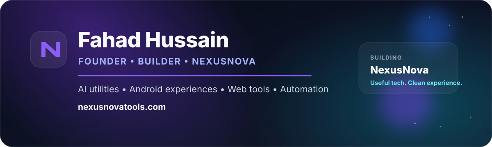

<div align="center">



### Building useful digital products, AI utilities and polished Android experiences 🚀

[](https://nexusnovatools.com)
[](https://github.com/fahadsoomro123/nexusnova-app)
[](mailto:nexusnovatools@gmail.com)

</div>

---

## 👋 About Me

I'm **Fahad Hussain**, the founder and builder behind **NexusNova** — a growing ecosystem of practical web tools, AI-powered utilities, automation and Android experiences.

> **My focus:** turn useful ideas into simple, polished products people can actually use.

- 🚀 Building and growing **NexusNova**
- 🤖 Exploring **AI utilities, automation and intelligent product experiences**
- 📱 Developing the **NexusNova Android app**
- 🌐 Building web tools at **[nexusnovatools.com](https://nexusnovatools.com)**
- ⚙️ Working across **Firebase, Cloudflare and GitHub automation**
- 🇵🇰 Based in **Pakistan**
- 📫 **nexusnovatools@gmail.com**

---

## ✨ NexusNova Ecosystem

<div align="center">

### One brand. Web + Android + AI + Automation.

**Free online tools • AI utilities • calculators • converters • PDF tools • Android experiences**

</div>

| Product | What it delivers |
| --- | --- |
| 🌐 **[NexusNova Web](https://nexusnovatools.com)** | Practical online tools and utilities in one growing platform |
| 📱 **[NexusNova Android](https://github.com/fahadsoomro123/nexusnova-app)** | Mobile-first utilities and polished everyday app experiences |
| 🤖 **NexusNova AI** | AI-assisted tools, smart workflows and automation experiences |
| ⚡ **NexusNova Automation** | GitHub, Cloudflare and connected-service workflows for reliable delivery |

<div align="center">

[](https://nexusnovatools.com)
[](https://github.com/fahadsoomro123/nexusnova-app)

</div>

---

## 🧰 Tech & Platforms

<div align="center">


</div>

---

## 🚀 Featured Projects

<table>
<tr>
<td width="50%" valign="top">

### 📱 NexusNova Android App

The Android side of the NexusNova ecosystem, focused on useful tools, mobile-first experiences and continuous product improvement.

**[View repository →](https://github.com/fahadsoomro123/nexusnova-app)**

</td>
<td width="50%" valign="top">

### 🌐 NexusNova Website

The web platform behind **nexusnovatools.com**, bringing practical online tools and utilities together in one destination.

**[View repository →](https://github.com/fahadsoomro123/nexusnova-website)**

</td>
</tr>
</table>

---

## 🎯 Current Focus

```text
NEXUSNOVA
├── Android experiences
├── AI-powered utilities
├── Web tools & product UX
├── Firebase integrations
├── Cloudflare services
└── GitHub automation & delivery
```

---

## 📈 Build Philosophy

**Useful first. Reliable always. Premium where it matters.**

I care about making products that are clear, practical and continuously improving — from the first interaction to the final production workflow.

---

## 🤝 Connect with NexusNova

<div align="center">

[](https://nexusnovatools.com)
[](https://web.facebook.com/NexusNovaTools/)
[](https://t.me/NexusNovaTools)
[](https://t.me/NexusNovaToolsBot)
[](mailto:nexusnovatools@gmail.com)

</div>

---

<div align="center">

### ⚡ Building NexusNova, one useful feature at a time.

**[nexusnovatools.com](https://nexusnovatools.com)**

<sub>Fahad Hussain • Founder & Builder of NexusNova</sub>

</div>
